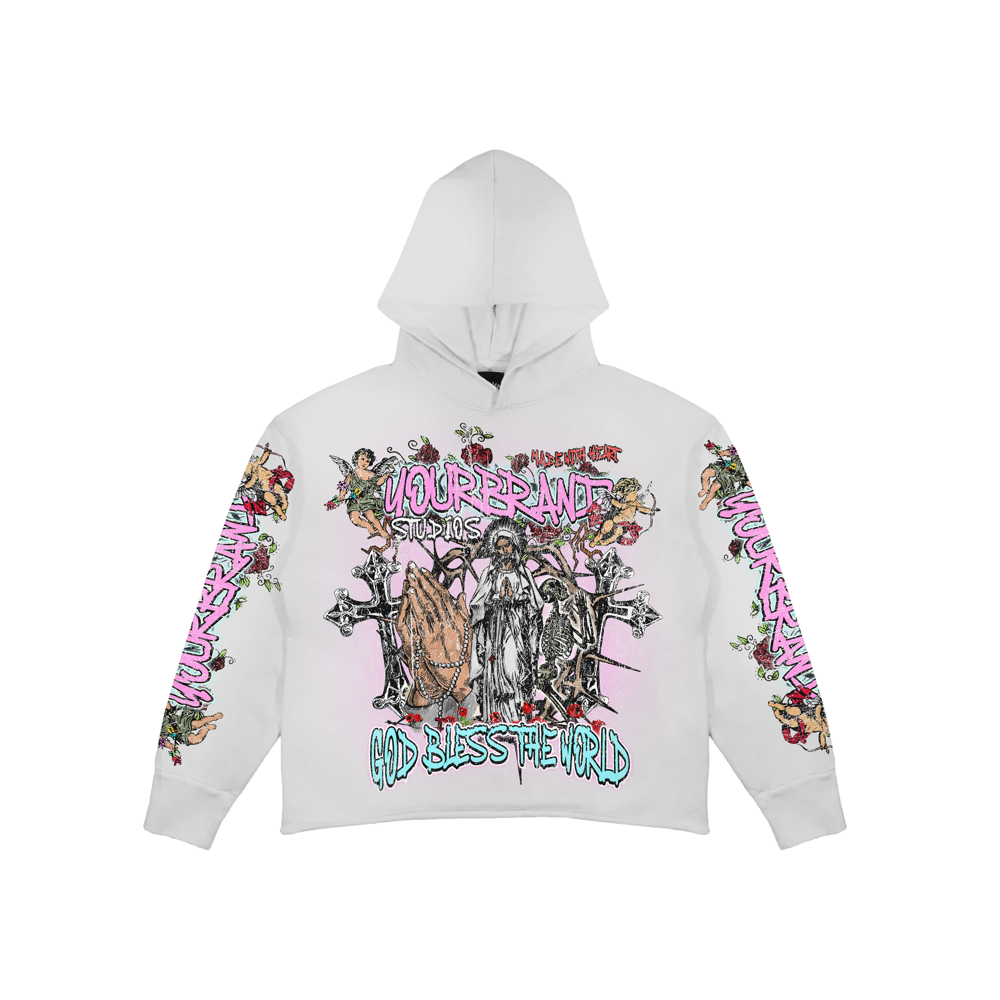
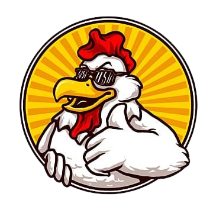

Software Requirements Specification for SKENA Version 1.0 approved
 `Prepared by`
1. Vitto Farin Kris	(22091397096)
2. Rendareista N.R	(22091397108)
3. M.Zidane Rizky	(22091397111)
 **D4 MANAJEMEN INFORMATIKA FAKULTAS VOKASI UNIVERSITAS NEGERI SURABAYA**
 `10 September 2023`
 `Table of Contents`
<pre>	Introduction					1
1. 1 	Purpose						1
1. 2	Document Conventions				1
1. 3	Intended Audience and Reading Suggestions	1</pre>
<pre>	Overall Description				1
2. 1	Product Perspective				1
2. 2	Product Functions				1
2. 3	User Classes and Characteristics		2
2. 4	Operating Environment				3</pre>
<pre>	External Interface Requirements			3
3. 1	User Interfaces					3
3. 2	Hardware Interfaces				3
3. 3	Software Interfaces				3</pre>
<pre>	System Features					3
4. 1	Homepage / Halaman Utama			3
4. 2	System Feature 2 (and so on)			4</pre>
<pre>	Other Nonfunctional Requirements		4
5. 1	Performance Requirements			4
5. 2	Safety Requirements				4
5. 3	Security Requirements				5
5. 4	Software Quality Attributes			5
5. 5	Business Rules					5</pre>
<pre>	Other Requirements				5</pre>

Revision History
Name	Date	Reason For Changes	Version
1.	**Introduction**
 
1. 1 Purpose 

Di era yang berkembang pesat seperti sekarang ini, teknologi menjadi salah satu penyumbang wadah yang semakin pesat dalam perubahannya. Khususnya dalam dunia industri, desain sangat dibutuhkan baik untuk komersial maupun non komersial sebagai pengikat pelanggan/orang yang memang butuh dalam bidangnya. Pelanggan juga ingin menemukan dan mencari jasa desain yang efisien, sesuai dengan kebutuhan mereka, dan cepat tanggap jika memang ada perubahan. Untuk itu, pembuatan website jasa desain dapat digunakan oleh khalayak umum yang mana dapat memberikan peluang dalam dunia industri, khususnya nya yang bekerja/berkecimpung di dunia desain.

1. 2	Document Conventions

Definisi dan istilah
  ●	Website: Sebuah halaman yang dapat diakses di internet dengan isi yang bersifat informatif, baik secara pendidikan, promosi produk, dll.
  ●	Skena: Nama dari jasa pembuatan desain kami dengan melibatkan berita terkini
  ●	DKV: Desain Komunikasi Visual

1. 3	Intended Audience and Reading Suggestions

Website Skena diperuntukkan untuk para pedesain, terutama mahasiswa DKV yang ingin mengambangkan bakat nya dalam mendesain dengan penghasilan yang didapatkan dapat membatu mahasiswa ketika berkuliah. Selain itu, kami mendukung adanya UKM / Warga / masyarakat yang ingin belajar mendesain sekaligus belajar menggunakan teknologi internet dalam melakukan jual beli jasa desain ini.

 

2.	**Overall Description**
 
2. 1	Product Perspective

Website ini bernama SKENA. Skena merupakan website yang memiliki peran sebagai jasa pembuatan dan penjualan desain. Website Skena memberikan banyak peluang untuk orang-orang terutama mahasiswa DKV yang memiliki keahlian dalam membuat desain, baik desain baju, logo, poster, bahkan desain apapun untuk menjualkan desainnya. Website Skena berfokuskan kepada mahasiswa DKV yang mana dapat membantu mahasiswa DKV memiliki nilai jual dan peluang usaha yang sesuai dengan setiap desain yang dibuatnya. Tak hanya mahasiswa DKV, setiap orang yang memiliki minat dan bakat dalam mendesain produk, dapat menggunakan website Skena. 

 
2. 2	Product Functions
 
	●	Membuat desain secara gratis dengan berbagai contoh / referensi yang menarik
 	●	Mengenalkan desain produk kepada khalayak umum
 	●	Memberikan nilai jual kepada desain produk yang sesuai
 	●	Membantu mahasiswa DKV dan pecinta desain mempromosikan desainnya
 
 
2. 3	User Classes and Characteristics
 

| Kategori Pengguna | Tugas | Hak Akses ke aplikasi | Kemampuan yang harus dimiliki |
|-------------------|-------|-----------------------|-------------------------------|
| Admin	|Melihat Laporan | Memasukkan, Edit, Menghapus Data | Memantau laporan hasil penjualan |
|| Edit akun penjual | Memasukkan, Edit, Menghapus Data | Mengedit akun penjual, menghapus yang tidak sesuai dengan perjanjian kerjasama mitra|
||Edit produk|Memasukkan, Edit, Menghapus Data produk|Memantau produk agar tidak terjadi plagiarisme|
||Mengirim notifikasi ke penjual, pembeli|Mengatur, mengedit, memberikan notifikasi terkait update website, produk, atau mitra|Memantau perubahan secara real time|
|Penjual|Melihat Laporan|Memasukkan, Edit, Menghapus Data|Memantau, mengedit laporan hasil penjualan|
||Edit Produk|Memasukkan, Edit, Menghapus Data produk|Membuat desain produk|
||Melihat pesanan yang masuk|Memasukkan, Edit, Menghapus Data pesanan|Memantau, memberikan konfirmasi terkait pemesanan produk klien|
||Mengirim pesan ke pembeli|Mengirim pesan terkait desain yang dipesan oleh klien|Memberikan pesan secara fast kepada klien|
|Pembeli|Melihat produk|Melihat produk|Melihat produk desain yang ada|
||Memilih produk|Memilih produk untuk disimpan, disukai, dimasukkan keranjang|Memilih desain yang sesuai dengan keinginan|
||Melakukan pembayaran|Melakukan pembayaran / checkout|Membayar sesuai harga desain menggunakan apl yang tersedia|
||Melihat status pesanan|Melihat status pesanan apakah desain sudah terkonfirmasi terjual|Melihat status pesanan dengan seksama|
||Memberikan feedback|Mengedit, membuat feedback terkait desain, terkait kecepatan penjual menjual|Memberikan feedback yang sesuai|
 
 
2. 4	Operating Environment
  ●	Server Operasi
 	Server website mengadopsi windows sebagai sistem pengoperasiannya
  ●	Server User
	Perangkat yang dapat digunakan oleh pengguna adalah : 
  		- Windows, Linux, MacOs, Android sebagai sistem operasi untuk menjalankannya
 		- Chrome, Mozilla, Opera, Internet Explorer untuk menjalankan operasinya
 
 

3.	**External Interface Requirements**
 
3.1	User Interfaces
  Describe the logical characteristics of each interface between the software product and the users. This may include sample screen images, any GUI standards or product family style guides that are to be followed, screen layout constraints, standard buttons and functions (e.g., help) that will appear on every screen, keyboard shortcuts, error message display standards, and so on. Define the software components for which a user interface is needed. Details of the user interface design should be documented in a separate user interface specification.
 	
 
3.2	Hardware Interfaces
  Antarmuka perangkat keras yang digunakan:
  1.	HP, PC, Laptop untuk membuka website dan mengedit desain
 
 
3.3	Software Interfaces
  Antarmuka perangkat lunak yang digunakan:
  1)	Windows, Linux, MacOs, Android sebagai sistem operasi untuk menjalankannya
  2)	Chrome, Mozilla, Opera, Internet Explorer untuk menjalankan operasinya
 
 

4.	**System Features**
  Fitur Sistem yang ada di website kami:
 
4.1	Homepage / Halaman Utama (index)
 
  4.1.1	Description and Priority
  Halaman utama menampilkan halaman utama skena itu sendiri dengan menu yang tersedia yakni menu home, logo, desain, sign up, dan tombol menekan desain.
  
  4.1.2	Stimulus/Response Sequences
  Stimulus 1: Admin, penjual ataupun pembeli membuka website 
  Respon 1: Sistem menampilkan halaman utama skena
  Stimulus 2: Penjual menekan button design
  Respon 2: Sistem akan membukakan halaman untuk mengedit desain
  Stimulus 3: Admin, penjual ataupun pembeli menekan halaman logo
  Respon 3: Sistem akan menampikan halaman berbagai desain logo (yang mana logo ini menjadi sauatu ikon desain paling utama skena)
  Stimulus 4: Admin, penjual ataupun pembeli menekan halaman desain
  Respon 4: Sistem menampilkan halaman dengan berbagai desain yang ada di skena
  Stimulus 5: Penjual dan pembeli sign up
  Respon 5: Sistem menampilkan halaman sign up hanya untuk penjual dan pembeli
 
 
4.1.3	Functional Requirements

   
|Halaman Utama|Aktor|Aksi|
|-------------|-----------------------|---------------|
||Admin, penjual, pembeli|Membuka website|
||sistem|Membuka website|
||penjual|Membuat desain|
||sistem|Mengarahkan ke halaman membuat desain|
||Admin, penjual, pembeli|Menekan menu logo|
||sistem|Mengarahkan ke halaman yang penuh desain/referensi logo| 
||penjual, pembeli|Sign Up|
||sistem|Memberikan halaman sign up|

 
 
 
4.2	Dashboard
 
 	4.2.1	Description dan Priority
  	Dashboard berisi....

5.	**Other Nonfunctional Requirements**
 
5.1	Performance Requirements
  •	Kecepatan memuat halaman
  •	Responsif, yakni dapat dikases dengan baik di berbagai perangkat
  •	Kineja server, server harus mampu menangani lalu lintas website yang baik
  •	Optimalisasi web, harus mengoptimalkan web agar tidak terjadi perlambatan 
 
 
5.2	Safety Requirements
  •	Monitoring Keamanan setiap beberapa bulan sekali (3 buklan sekali)
  •	Autentikasi Ganda, kami akan meminta pengguna untuk memverifikasi apakah email dan nomor telp yang digunakan untuk sign up / sign in adalah benar
  •	Backup rutin tiap beberapa bulan sekali (3 bulan sekali)
 
 
5.3	Security Requirements
  •	Manajemen kata sandi, kami akan menyarankan sandi dengan pola yang kompleks dan rumit, tetapi user dapat menambahkan sesuai keinginannya
  •	Pembaruan perangkat lunak menandakan terdapat versi terbaru dari pengembangan website kami
 
 
5.4	Software Quality Attributes
  •	Performa, Dapat merespon pembuatan desain atau perubahan pembuatan desain, merespon pembayaran, dll dengan cepat
  •	Keamanan, melalui login dan registrasi yang diharuskan mengirimkan kode kepada sang regis baik melalui email ataupun wa 
  •
 
 
5.5	Business Rules
  List any operating principles about the product, such as which individuals or roles can perform which functions under specific circumstances. These are not functional requirements in themselves, but they may imply certain functional requirements to enforce the rules.
 
 

6.	**Other Requirements**
  Define any other requirements not covered elsewhere in the SRS. This might include database requirements, internationalization requirements, legal requirements, reuse objectives for the project, and so on. Add any new sections that are pertinent to the project.>
  Appendix A: Glossary
  Define all the terms necessary to properly interpret the SRS, including acronyms and abbreviations. You may wish to build a separate glossary that spans multiple projects or the entire organization, and just include terms specific to a single project in each SRS.

  Appendix B: Analysis Models
Use Case Diagram
![alt text]

Flowchart
![alt text]
 

Desain Website

 

 
Appendix C: To Be Determined List
  <Collect a numbered list of the TBD (to be determined) references that remain in the SRS so they can be tracked to closure.>

Appendix D: Source Code dan Penjelasan
  Berikut adalah index / homepage ketika memasuki web kami:
<!DOCTYPE html>
<html lang="en">
<head>
    <meta charset="UTF-8">
    <meta name="viewport" content="width=device-width, initial-scale=1.0">
    <title>Skena.</title>
    <!--Fonts Google-->
    <link rel="preconnect" href="https://fonts.googleapis.com">
    <link rel="preconnect" href="https://fonts.gstatic.com" crossorigin>
    <link href="https://fonts.googleapis.com/css2?family=Playfair+Display:wght@400;500;600;700&family=Ubuntu:wght@400;500;700&display=swap" rel="stylesheet">
    <!--Style-->
    <link rel="stylesheet" href="index.css">
</head>
<body>
    

        

            

                

                    <a href="#">
                        
                        K E N A.
                    </a>    
                

                

                    
                

            

            

                

                    <a href="#">
                        
                        Dashboard
                    </a>
                

            

            

                

                    <a href="clothesdesign.html">
                        
                        Design Baju
                    </a>
                

            

            

                

                    <a href="clothesdesign.html">
                        
                        Design Logo
                    </a>
                

            

            

                

                    <a href="keranjang.html">
                        
                        Keranjang
                    </a>
                

            

            

                

                    <a href="pesanan.html">
                        
                        Pesanan
                    </a>
                

            

            

                

                    <a href="#">
                        
                        Ulasan
                    </a>
                

            

        

        

            
            

                <input type="checkbox" id="menu-checkbox">
                <label for="menu-checkbox"  id="menu-label">
                    

                </label>
            

            

                

                    

                        
                        <h3>Skeleton Negetive</h3>
                        
Description of Product 1.

                        $19.99
                    

                    

                        
                        <h3>Hodie Your Brand</h3>
                        
Description of Product 2.

                        $24.99
                    

                    

                        
                        <h3>Falcon Your Brand</h3>
                        
Description of Product 2.

                        $20.99
                    

                    

                        
                        <h3>Lips Your Brand</h3>
                        
Description of Product 2.

                        $24.99
                    

                    

                        
                        <h3>Chicken Logo</h3>
                        
Description of Product 2.

                        $24.99
                    

                    

                        
                        <h3>Delicious Logo</h3>
                        
Description of Product 2.

                        $24.99
                    

                

            

        

    

    
</body>
</html>
  Penjelasan Index:
  - "DOCTYPE html": Ini adalah deklarasi dokumen yang menginformasikan browser bahwa halaman ini menggunakan standar HTML.
  - "html lang="en"": Ini adalah elemen root yang mengawali seluruh dokumen HTML. lang="en" mengindikasikan bahwa bahasa yang digunakan dalam dokumen ini adalah bahasa Inggris.
  - "head": Bagian ini berisi informasi tentang halaman, seperti charset, viewport, judul halaman, dan tautan ke file eksternal (CSS dan JavaScript).
  - "meta charset="UTF-8">" Ini mengatur pengkodean karakter untuk halaman HTML ke UTF-8, yang umumnya digunakan untuk mendukung karakter khusus dan multi-bahasa.
  - "meta name="viewport" content="width=device-width, initial-scale=1.0": Ini adalah tag meta viewport yang membantu dalam menyesuaikan tampilan halaman ke ukuran perangkat pengguna.
  - "title>Skena.</title": Ini adalah judul halaman web yang akan ditampilkan pada tab browser.
  - "link rel="stylesheet" href="nyobasidebar.css">, link rel="stylesheet" href="logodesign.css": Ini adalah tautan ke file CSS eksternal yang digunakan untuk mengatur tampilan dan gaya halaman web.
  - "link rel="preconnect" href="https://fonts.googleapis.com", "link rel="preconnect" href="https://fonts.gstatic.com" crossorigin", "link href="https://fonts.googleapis.com/css2?family=Playfair+Display:wght@400;500;600;700&family=Ubuntu:wght@400;500;700&display=swap" rel="stylesheet": Ini adalah tautan ke Google Fonts untuk mengimpor jenis huruf (font) yang akan digunakan dalam halaman.
  - "body": Ini adalah elemen utama yang berisi semua konten yang akan ditampilkan dalam halaman web. Bagian konten dalam <body>: Ini mencakup elemen-elemen seperti gambar, teks, tautan, dan lainnya yang akan ditampilkan kepada pengguna.
  - "script": Ini adalah tag JavaScript yang digunakan untuk menyisipkan kode JavaScript dalam halaman web. Dalam kasus ini, Anda memuat script JavaScript dari file eksternal dengan menggunakan "script src="sidebar.js"></script".

