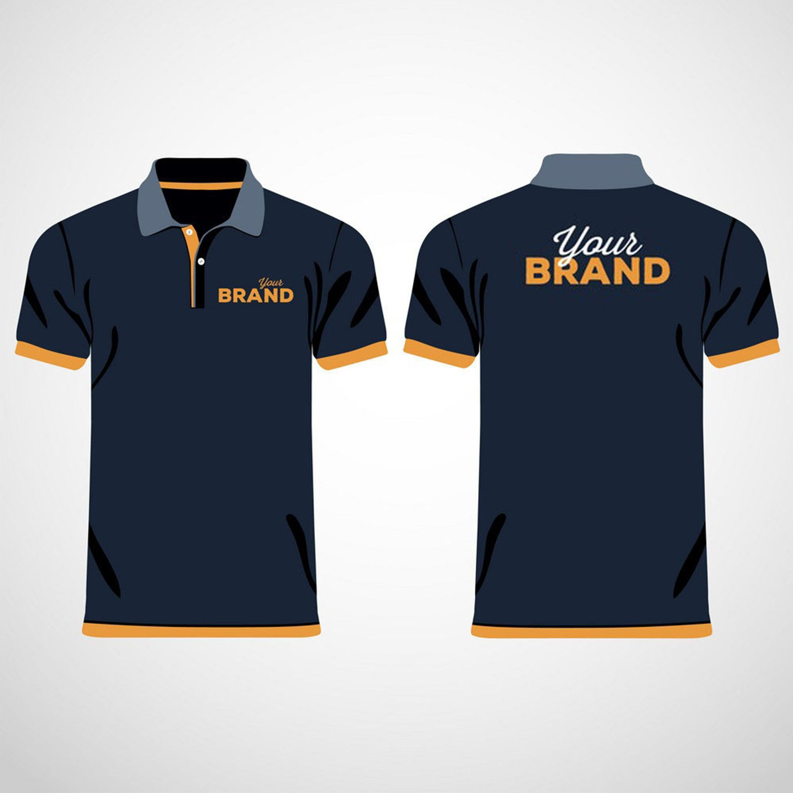
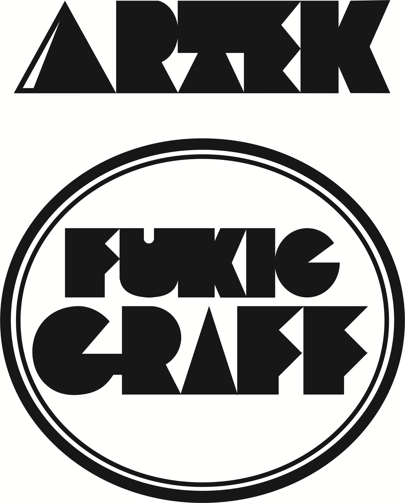
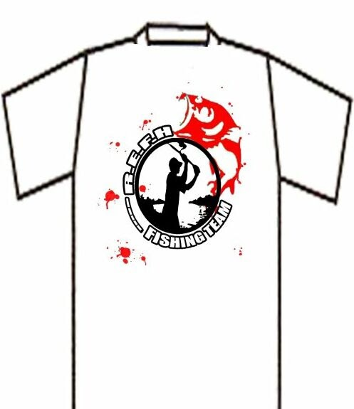
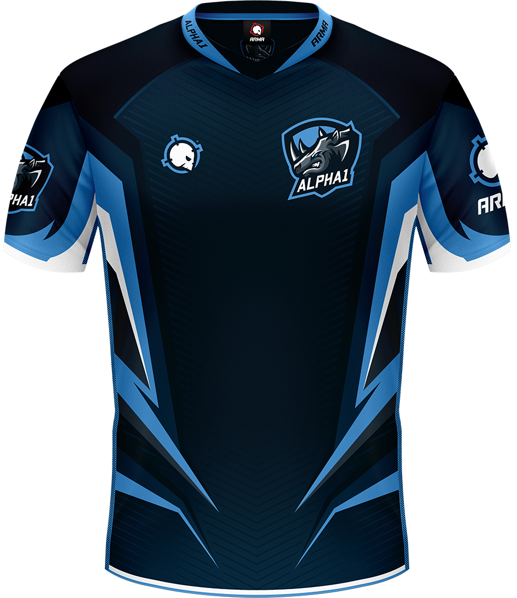
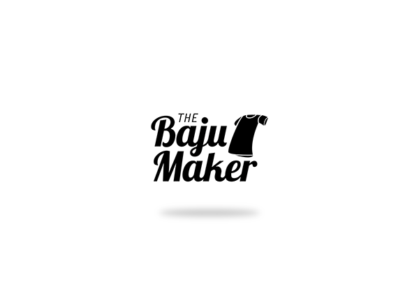

Software Requirements Specification for SKENA Version 1.0 approved
 `Prepared by`
1. Vitto Farin Kris	(22091397096)
2. Rendareista N.R	(22091397108)
3. M.Zidane Rizky	(22091397111)
 **D4 MANAJEMEN INFORMATIKA FAKULTAS VOKASI UNIVERSITAS NEGERI SURABAYA**
 `10 September 2023`
 `Table of Contents`
<pre>	Introduction					1
1. 1 	Purpose						1
1. 2	Document Conventions				1
1. 3	Intended Audience and Reading Suggestions	1</pre>
<pre>	Overall Description				1
2. 1	Product Perspective				1
2. 2	Product Functions				1
2. 3	User Classes and Characteristics		2
2. 4	Operating Environment				3</pre>
<pre>	External Interface Requirements			3
3. 1	User Interfaces					3
3. 2	Hardware Interfaces				3
3. 3	Software Interfaces				3</pre>
<pre>	System Features					3
4. 1	Homepage / Halaman Utama			3
4. 2	System Feature 2 (and so on)			4</pre>
<pre>	Other Nonfunctional Requirements		4
5. 1	Performance Requirements			4
5. 2	Safety Requirements				4
5. 3	Security Requirements				5
5. 4	Software Quality Attributes			5
5. 5	Business Rules					5</pre>
<pre>	Other Requirements				5</pre>

Revision History
Name	Date	Reason For Changes	Version
1.	**Introduction**
 
1. 1 Purpose 

Di era yang berkembang pesat seperti sekarang ini, teknologi menjadi salah satu penyumbang wadah yang semakin pesat dalam perubahannya. Khususnya dalam dunia industri, desain sangat dibutuhkan baik untuk komersial maupun non komersial sebagai pengikat pelanggan/orang yang memang butuh dalam bidangnya. Pelanggan juga ingin menemukan dan mencari jasa desain yang efisien, sesuai dengan kebutuhan mereka, dan cepat tanggap jika memang ada perubahan. Untuk itu, pembuatan website jasa desain dapat digunakan oleh khalayak umum yang mana dapat memberikan peluang dalam dunia industri, khususnya nya yang bekerja/berkecimpung di dunia desain.

1. 2	Document Conventions

Definisi dan istilah
  ●	Website: Sebuah halaman yang dapat diakses di internet dengan isi yang bersifat informatif, baik secara pendidikan, promosi produk, dll.
  ●	Skena: Nama dari jasa pembuatan desain kami dengan melibatkan berita terkini
  ●	DKV: Desain Komunikasi Visual

1. 3	Intended Audience and Reading Suggestions

Website Skena diperuntukkan untuk para pedesain, terutama mahasiswa DKV yang ingin mengambangkan bakat nya dalam mendesain dengan penghasilan yang didapatkan dapat membatu mahasiswa ketika berkuliah. Selain itu, kami mendukung adanya UKM / Warga / masyarakat yang ingin belajar mendesain sekaligus belajar menggunakan teknologi internet dalam melakukan jual beli jasa desain ini.

 

2.	**Overall Description**
 
2. 1	Product Perspective

Website ini bernama SKENA. Skena merupakan website yang memiliki peran sebagai jasa pembuatan dan penjualan desain. Website Skena memberikan banyak peluang untuk orang-orang terutama mahasiswa DKV yang memiliki keahlian dalam membuat desain, baik desain baju, logo, poster, bahkan desain apapun untuk menjualkan desainnya. Website Skena berfokuskan kepada mahasiswa DKV yang mana dapat membantu mahasiswa DKV memiliki nilai jual dan peluang usaha yang sesuai dengan setiap desain yang dibuatnya. Tak hanya mahasiswa DKV, setiap orang yang memiliki minat dan bakat dalam mendesain produk, dapat menggunakan website Skena. 

 
2. 2	Product Functions
 
	●	Membuat desain secara gratis dengan berbagai contoh / referensi yang menarik
 	●	Mengenalkan desain produk kepada khalayak umum
 	●	Memberikan nilai jual kepada desain produk yang sesuai
 	●	Membantu mahasiswa DKV dan pecinta desain mempromosikan desainnya
 
 
2. 3	User Classes and Characteristics
 

| Kategori Pengguna | Tugas | Hak Akses ke aplikasi | Kemampuan yang harus dimiliki |
|-------------------|-------|-----------------------|-------------------------------|
| Admin	|Melihat Laporan | Memasukkan, Edit, Menghapus Data | Memantau laporan hasil penjualan |
|| Edit akun penjual | Memasukkan, Edit, Menghapus Data | Mengedit akun penjual, menghapus yang tidak sesuai dengan perjanjian kerjasama mitra|
||Edit produk|Memasukkan, Edit, Menghapus Data produk|Memantau produk agar tidak terjadi plagiarisme|
||Mengirim notifikasi ke penjual, pembeli|Mengatur, mengedit, memberikan notifikasi terkait update website, produk, atau mitra|Memantau perubahan secara real time|
|Penjual|Melihat Laporan|Memasukkan, Edit, Menghapus Data|Memantau, mengedit laporan hasil penjualan|
||Edit Produk|Memasukkan, Edit, Menghapus Data produk|Membuat desain produk|
||Melihat pesanan yang masuk|Memasukkan, Edit, Menghapus Data pesanan|Memantau, memberikan konfirmasi terkait pemesanan produk klien|
||Mengirim pesan ke pembeli|Mengirim pesan terkait desain yang dipesan oleh klien|Memberikan pesan secara fast kepada klien|
|Pembeli|Melihat produk|Melihat produk|Melihat produk desain yang ada|
||Memilih produk|Memilih produk untuk disimpan, disukai, dimasukkan keranjang|Memilih desain yang sesuai dengan keinginan|
||Melakukan pembayaran|Melakukan pembayaran / checkout|Membayar sesuai harga desain menggunakan apl yang tersedia|
||Melihat status pesanan|Melihat status pesanan apakah desain sudah terkonfirmasi terjual|Melihat status pesanan dengan seksama|
||Memberikan feedback|Mengedit, membuat feedback terkait desain, terkait kecepatan penjual menjual|Memberikan feedback yang sesuai|
 
 
2. 4	Operating Environment
  ●	Server Operasi
 	Server website mengadopsi windows sebagai sistem pengoperasiannya
  ●	Server User
	Perangkat yang dapat digunakan oleh pengguna adalah : 
  		- Windows, Linux, MacOs, Android sebagai sistem operasi untuk menjalankannya
 		- Chrome, Mozilla, Opera, Internet Explorer untuk menjalankan operasinya
 
 

3.	**External Interface Requirements**
 
3.1	User Interfaces
  Describe the logical characteristics of each interface between the software product and the users. This may include sample screen images, any GUI standards or product family style guides that are to be followed, screen layout constraints, standard buttons and functions (e.g., help) that will appear on every screen, keyboard shortcuts, error message display standards, and so on. Define the software components for which a user interface is needed. Details of the user interface design should be documented in a separate user interface specification.
 	
 
3.2	Hardware Interfaces
  Antarmuka perangkat keras yang digunakan:
  1.	HP, PC, Laptop untuk membuka website dan mengedit desain
 
 
3.3	Software Interfaces
  Antarmuka perangkat lunak yang digunakan:
  1)	Windows, Linux, MacOs, Android sebagai sistem operasi untuk menjalankannya
  2)	Chrome, Mozilla, Opera, Internet Explorer untuk menjalankan operasinya
 
 

4.	**System Features**
  Fitur Sistem yang ada di website kami:
 
4.1	Homepage / Halaman Utama (index)
 
  4.1.1	Description and Priority
  Halaman utama menampilkan halaman utama skena itu sendiri dengan menu yang tersedia yakni menu home, logo, desain, sign up, dan tombol menekan desain.
  
  4.1.2	Stimulus/Response Sequences
  Stimulus 1: Admin, penjual ataupun pembeli membuka website 
  Respon 1: Sistem menampilkan halaman utama skena
  Stimulus 2: Penjual menekan button design
  Respon 2: Sistem akan membukakan halaman untuk mengedit desain
  Stimulus 3: Admin, penjual ataupun pembeli menekan halaman logo
  Respon 3: Sistem akan menampikan halaman berbagai desain logo (yang mana logo ini menjadi sauatu ikon desain paling utama skena)
  Stimulus 4: Admin, penjual ataupun pembeli menekan halaman desain
  Respon 4: Sistem menampilkan halaman dengan berbagai desain yang ada di skena
  Stimulus 5: Penjual dan pembeli sign up
  Respon 5: Sistem menampilkan halaman sign up hanya untuk penjual dan pembeli
 
 
4.1.3	Functional Requirements

   
|Halaman Utama|Aktor|Aksi|
|-------------|-----------------------|---------------|
||Admin, penjual, pembeli|Membuka website|
||sistem|Membuka website|
||penjual|Membuat desain|
||sistem|Mengarahkan ke halaman membuat desain|
||Admin, penjual, pembeli|Menekan menu logo|
||sistem|Mengarahkan ke halaman yang penuh desain/referensi logo| 
||penjual, pembeli|Sign Up|
||sistem|Memberikan halaman sign up|

 
 
 
4.2	Dashboard
 
 	4.2.1	Description dan Priority
  	Dashboard sama dengan homepage, ketika anda memasuki homepage, maka sudah memasuki dashboard juga.
 
 	4.2.2	Stimulus / Response Sequences
 	Stimulus 1: Admin, penjual ataupun pembeli membuka website 
  	Respon 1: Sistem menampilkan halaman utama skena
  	Stimulus 2: Penjual menekan button design
  	Respon 2: Sistem akan membukakan halaman untuk mengedit desain
  	Stimulus 3: Admin, penjual ataupun pembeli menekan halaman logo
  	Respon 3: Sistem akan menampikan halaman berbagai desain logo (yang mana logo ini menjadi sauatu ikon desain paling utama skena)
  	Stimulus 4: Admin, penjual ataupun pembeli menekan halaman desain
  	Respon 4: Sistem menampilkan halaman dengan berbagai desain yang ada di skena
  	Stimulus 5: Penjual dan pembeli sign up
  	Respon 5: Sistem menampilkan halaman sign up hanya untuk penjual dan pembeli
 
 
4.2.3	Functional Requirements

   
|Dashboard|Aktor|Aksi|
|-------------|-----------------------|---------------|
||Admin, penjual, pembeli|Membuka website|
||sistem|Membuka website|
||penjual|Membuat desain|
||sistem|Mengarahkan ke halaman membuat desain|
||Admin, penjual, pembeli|Menekan menu logo|
||sistem|Mengarahkan ke halaman yang penuh desain/referensi logo| 
||penjual, pembeli|Sign Up|
||sistem|Memberikan halaman sign up|

  
 
4.3 	Desain Baju
 
  	4.3.1	Description and Priority
 	Dalam menu ini berisi semua desain baju yang ada untuk dijual
 
 	4.3.2	Stimulus / Response Sequences
 	Stimulus 1: Admin, penjual ataupun pembeli membuka website 
  	Respon 1: Sistem menampilkan desain baju website
  	Stimulus 2: Admin melihat halaman desain baju, mengedit halaman desain baju, menghapus desain baju, mengatur lokasi desain baju
 	Respon 2: Sistem mengedit, menghapus halaman desain baju
 	Stimulus 3: Penjual melihat halaman desain baju, meengedit halaman desain bajunya sendiri (tokonya sendiri), mengatur lokasi desain bajunya sendiri
 	Respon 3: Sistem menampilkan halaman desain, mengedit halaman desain baju penjual sendiri, mengatur lokasi desain bajunya sendiri
 	Stimulus 4: Pembeli/pelanggan melihat halaman desian baju, melihat info desain baju
 	Respon 5: Sistem menamplikan halaman desain baju, memperlihatkan infromasi informasi yang tertea di deain baju
 
 
 	Functional Requirements

|Desain Baju|Aktor|Aksi|
|--------------|-----------------------|--------------------|
||Admin, Penjual, Pembeli|membuka halaman desain baju|
||Sistem|menampilkan halaman desain baju|
||Admin|Lihat, Edit, Hapus, Atur desain baju|
||Sistem|Edit, hapus, atur desian baju|
||Penjual|Lihat, Edit toko masing-masing, atur desain baju masing-masing|
||Sistem|menampilkan halaman desain, mengedit halaman desain baju penjual sendiri, mengatur lokasi desain bajunya sendiri|
||Pembeli|Lihat, melihat informasi desain baju|
||Sistem|Lihat, menampilkan informasi dari halaman itu|

 
 
4.4	Desain Logo
 
 	4.4.1 Description and prioity
 	Dalam menu ini berisikan semua desain logo untuk dijual
 
 	4.4.2 Stimulus / Response Sequnces
 	Stimulus 1: Admin, penjual ataupun pembeli membuka website 
  	Respon 1: Sistem menampilkan desain logo website
  	Stimulus 2: Admin melihat halaman desain logo, mengedit halaman desain logo, menghapus desain logo, mengatur lokasi desain logo
 	Respon 2: Sistem mengedit, menghapus halaman desain baju
 	Stimulus 3: Penjual melihat halaman desain logo, meengedit halaman desain logonya sendiri (tokonya sendiri), mengatur lokasi desain ;ogonya sendiri
 	Respon 3: Sistem menampilkan halaman desain, mengedit halaman desain logo penjual sendiri, mengatur lokasi desain logonya sendiri
 	Stimulus 4: Pembeli/pelanggan melihat halaman desian logo, melihat info desain logo
 	Respon 5: Sistem menamplikan halaman desain logo, memperlihatkan infromasi informasi yang tertea di deain logo
 
 
 	Functional Requirements

|Desain Logo|Aktor|Aksi|
|--------------|-----------------------|--------------------|
||Admin, Penjual, Pembeli|membuka halaman desain logo|
||Sistem|menampilkan halaman desain logo|
||Admin|Lihat, Edit, Hapus, Atur desain logo|
||Sistem|Edit, hapus, atur desian logo|
||Penjual|Lihat, Edit toko masing-masing, atur desain logo masing-masing|
||Sistem|menampilkan halaman desain, mengedit halaman desain logo penjual sendiri, mengatur lokasi desain logonya sendiri|
||Pembeli|Lihat, melihat informasi desain logo|
||Sistem|Lihat, menampilkan informasi dari halaman itu|

 
 
4.5	Keranjang
 
 	4.5.1 Description and pirority
  	Menu keranjang pemesanan
 	
 	4.5.2 Stimulus / Response Sequence
  	Stimulus 1: Pembeli mengeklik tombol tambahkan ke keranjang
 	Response 1: Sistem menambahkan produk kedalam keranjang
 	Stimulus 2: Pembeli mengeklik tombol keranjang
 	Response 2: Sistem menampilkan keranjang
 	Stimulus 3: Pembeli mengeklik tombol hapus dalam keranjang
 	Response 3: Sistem menghapus produk yang yang dipilih
 	Stimulus 4: Pembeli mengubah jumlah produk 
 	Response 4: Sistem mengubah jumlah produk sesuai yang diinginkan pembeli
 	Stimulus 5: Pembeli mengeklik tombol lanjutkan checkout
 	Response 5: Sistem meanjutkan sesi checkout
 	Stimulus 6: Pembeli kembali ke menu kembali belanja
 	Response 6: Sistem mengembalikan ke tampilan dashboard
 
 
 	Functional Requirements

|Keranjang|Aktor|Aksi|
|--------------|--------------|---------------|
||Pembeli|Mengeklik tombol tambah keranjang|
||Sistem|Menambah produk dalam keranjang|
||Pembeli|Mengeklik tombol keranjang|
||Sistem|Menampilkan halaman keranjang|
||Pembeli|Menghapus produk|
||sistem|Menghapus produk|
||Pembeli|Mengubah jumlah produk|
||Sistem|Mengubah jumlah produk|
||Pembeli|Melanjutkan ke sistem checkout|
||Sistem|Menampilkan halaman checkout|

 
 
4.6 	Pesanan
 
 	4.6.1 Description and priority
 	
 	Menu Pesanan yang berisi pesanan apa saja yang telah dipesan
 
 	4.6.2 Stimulus/response sequences
 	Stimulus 1: Pembeli mengeklik fitur pesanan
 	Response 1: Sistem menampilkan fitur pesanan
 	Stimulus 2: Pembeli memilih pesanan tertentu
 	Response 2: Sistem menampilkan detail pesanan
 	Stimulus 3: Pembeli mengeklik tombo lacal pesanan
 	Response 3: Sistem menampilkan halaman lacak pesanan sampai mana pesanan itu
 	Stimulus 4: Pembeli mengeklik cetak invoice
 	Response 4: Sistem menampilkan invoice baik dalam pdf atau format yanng ada
 
 
 	Functional Requirements

|Pesanan|Aktor|Aksi|
|--------------------|-------------------|-----------------------|
||Pembeli|Klik menu pesanan|
||Sistem|Menampilkan menu pesanan|
||Pembeli|Memilih pesanan tertentu|
||Sistem|Menampilkan detail pesanan yang dipilih|
||Pembeli|Klik tombol lacak pesanan|
||Sistem|Menampilkan halaman lacak pesanan|
||Pembeli|Klik cetak invoice|
||Sistem|menampilkan invoice|

 
 

5.	**Other Nonfunctional Requirements**
 
5.1	Performance Requirements
  •	Kecepatan memuat halaman
  •	Responsif, yakni dapat dikases dengan baik di berbagai perangkat
  •	Kineja server, server harus mampu menangani lalu lintas website yang baik
  •	Optimalisasi web, harus mengoptimalkan web agar tidak terjadi perlambatan 
 
 
5.2	Safety Requirements
  •	Monitoring Keamanan setiap beberapa bulan sekali (3 buklan sekali)
  •	Autentikasi Ganda, kami akan meminta pengguna untuk memverifikasi apakah email dan nomor telp yang digunakan untuk sign up / sign in adalah benar
  •	Backup rutin tiap beberapa bulan sekali (3 bulan sekali)
 
 
5.3	Security Requirements
  •	Manajemen kata sandi, kami akan menyarankan sandi dengan pola yang kompleks dan rumit, tetapi user dapat menambahkan sesuai keinginannya
  •	Pembaruan perangkat lunak menandakan terdapat versi terbaru dari pengembangan website kami
 
 
5.4	Software Quality Attributes
  •	Performa, Dapat merespon pembuatan desain atau perubahan pembuatan desain, merespon pembayaran, dll dengan cepat
  •	Keamanan, melalui login dan registrasi yang diharuskan mengirimkan kode kepada sang regis baik melalui email ataupun wa 
  •
 
 
5.5	Business Rules
  List any operating principles about the product, such as which individuals or roles can perform which functions under specific circumstances. These are not functional requirements in themselves, but they may imply certain functional requirements to enforce the rules.
 
 

6.	**Other Requirements**
  Define any other requirements not covered elsewhere in the SRS. This might include database requirements, internationalization requirements, legal requirements, reuse objectives for the project, and so on. Add any new sections that are pertinent to the project.>
  Appendix A: Glossary
  Define all the terms necessary to properly interpret the SRS, including acronyms and abbreviations. You may wish to build a separate glossary that spans multiple projects or the entire organization, and just include terms specific to a single project in each SRS.

  Appendix B: Analysis Models
Use Case Diagram

Flowchart

 

Desain Website

 

 
Appendix C: To Be Determined List
  <Collect a numbered list of the TBD (to be determined) references that remain in the SRS so they can be tracked to closure.>

Appendix D: Source Code dan Penjelasan
  Berikut adalah index / homepage ketika memasuki web kami:
<!DOCTYPE html>
<html lang="en">
<head>
    <meta charset="UTF-8">
    <meta name="viewport" content="width=device-width, initial-scale=1.0">
    <title>Skena.</title>
    <!--Fonts Google-->
    <link rel="preconnect" href="https://fonts.googleapis.com">
    <link rel="preconnect" href="https://fonts.gstatic.com" crossorigin>
    <link href="https://fonts.googleapis.com/css2?family=Playfair+Display:wght@400;500;600;700&family=Ubuntu:wght@400;500;700&display=swap" rel="stylesheet">
    <!--Style-->
    <link rel="stylesheet" href="index.css">
</head>
<body>
    

        

            

                

                    <a href="#">
                        
                        K E N A.
                    </a>    
                

                

                    
                

            

            

                

                    <a href="#">
                        
                        Dashboard
                    </a>
                

            

            

                

                    <a href="clothesdesign.html">
                        
                        Design Baju
                    </a>
                

            

            

                

                    <a href="clothesdesign.html">
                        
                        Design Logo
                    </a>
                

            

            

                

                    <a href="keranjang.html">
                        
                        Keranjang
                    </a>
                

            

            

                

                    <a href="pesanan.html">
                        
                        Pesanan
                    </a>
                

            

            

                

                    <a href="#">
                        
                        Ulasan
                    </a>
                

            

        

        

            
            

                <input type="checkbox" id="menu-checkbox">
                <label for="menu-checkbox"  id="menu-label">
                    

                </label>
            

            

                

                    

                        
                        <h3>Skeleton Negetive</h3>
                        
Description of Product 1.

                        $19.99
                    

                    

                        
                        <h3>Hodie Your Brand</h3>
                        
Description of Product 2.

                        $24.99
                    

                    

                        
                        <h3>Falcon Your Brand</h3>
                        
Description of Product 2.

                        $20.99
                    

                    

                        
                        <h3>Lips Your Brand</h3>
                        
Description of Product 2.

                        $24.99
                    

                    

                        
                        <h3>Chicken Logo</h3>
                        
Description of Product 2.

                        $24.99
                    

                    

                        
                        <h3>Delicious Logo</h3>
                        
Description of Product 2.

                        $24.99
                    

                

            

        

    

    
</body>
</html>
  Penjelasan Index:
  - "DOCTYPE html": Ini adalah deklarasi dokumen yang menginformasikan browser bahwa halaman ini menggunakan standar HTML.
  - "html lang="en"": Ini adalah elemen root yang mengawali seluruh dokumen HTML. lang="en" mengindikasikan bahwa bahasa yang digunakan dalam dokumen ini adalah bahasa Inggris.
  - "head": Bagian ini berisi informasi tentang halaman, seperti charset, viewport, judul halaman, dan tautan ke file eksternal (CSS dan JavaScript).
  - "meta charset="UTF-8">" Ini mengatur pengkodean karakter untuk halaman HTML ke UTF-8, yang umumnya digunakan untuk mendukung karakter khusus dan multi-bahasa.
  - "meta name="viewport" content="width=device-width, initial-scale=1.0": Ini adalah tag meta viewport yang membantu dalam menyesuaikan tampilan halaman ke ukuran perangkat pengguna.
  - "title>Skena.</title": Ini adalah judul halaman web yang akan ditampilkan pada tab browser.
  - "link rel="stylesheet" href="nyobasidebar.css">, link rel="stylesheet" href="logodesign.css": Ini adalah tautan ke file CSS eksternal yang digunakan untuk mengatur tampilan dan gaya halaman web.
  - "link rel="preconnect" href="https://fonts.googleapis.com", "link rel="preconnect" href="https://fonts.gstatic.com" crossorigin", "link href="https://fonts.googleapis.com/css2?family=Playfair+Display:wght@400;500;600;700&family=Ubuntu:wght@400;500;700&display=swap" rel="stylesheet": Ini adalah tautan ke Google Fonts untuk mengimpor jenis huruf (font) yang akan digunakan dalam halaman.
  - "body": Ini adalah elemen utama yang berisi semua konten yang akan ditampilkan dalam halaman web. Bagian konten dalam <body>: Ini mencakup elemen-elemen seperti gambar, teks, tautan, dan lainnya yang akan ditampilkan kepada pengguna.
  - "script": Ini adalah tag JavaScript yang digunakan untuk menyisipkan kode JavaScript dalam halaman web. Dalam kasus ini, Anda memuat script JavaScript dari file eksternal dengan menggunakan "script src="sidebar.js"></script".

CSS:
*{
    font-family: 'Playfair Display', serif;
    padding: 0;
    margin: 0;
}

.container{
    display: flex;
    min-height: 100vh;
}

.sidebar {
    background-color: #3c3a3d;
    width: 260px;
    padding: 24px;
    display: flex;
    box-sizing: border-box;
    flex-direction: column;
    transition: all ease-in .3s;
}

.sidebar.hide {
    width: 87px;
    transition: all ease-out .3s;
}

.main-content{
    background-color: #EEEEEE;
    flex-grow: 1;
    display: flex;
}
.main-content .background {
    width: 100%;
    height: 100%;
    position: static;
}

.sidebar .icon {
    width: 26px;
    height: 26px;
    margin-top: 8px;
    margin-right: 20%;
}

.sidebar .description-header {
    font-style: normal;
    font-weight: 650;
    font-size: 30px;
    line-height: 0;
    margin-bottom: 20px;
    text-align: center;
    color: #FFFFFF;
}

.sidebar a{
    text-decoration: none;
}

.sidebar .header .list-item{
    display: flex;
    flex-direction: row;
    align-items: center;
    padding: 12px 10px;
    border-radius: 8px;
    background-color: rgb(0, 0, 0);
    height: 40px;
    box-sizing: border-box;
}

.sidebar.hide .description-header{
    display: none;
}

.sidebar .header .list-item .icon {
    margin-right:3px;
    margin-top: 5px;
}

.sidebar .header .illustration {
    display: flex;
    flex-direction: column;
    align-items: flex-start;
    padding: 10px;
    margin: 10px 0 20px 0;
    box-sizing: border-box;
}

.sidebar.hide .illustration {
    display: none;
}

.sidebar .main .list-item .description {
    font-size: 18px;
    font-weight: 400;
    font-style: normal;
    line-height: 16px;
    text-align: center;
    color: #ffffff;
    padding-left: 15px;
    padding-bottom: 5px;
}

.sidebar.hide .main .list-item .description {
    display: none;
}

.sidebar .main .list-item {
    display: flex;
    flex-direction: row;
    align-items: center;
    padding: 12px 10px;
    border-radius: 8px;
    /* width: 210px; */
    box-sizing: border-box;
    transition: all ease-in .2s;
}

.sidebar .main .list-item:hover {
    background: #FF9900;
    transition: all ease-in .2s;
}

/* Toogle Menu*/

#menu-button {
    width: 32px;
    position: absolute;
    overflow: hidden;
}

#menu-label {
    position: relative;
    display: block;
    height: 20px;
    cursor: pointer;
}

#hamburger {
    position: absolute;
    left: 0;
    width: 100%;
    height: 4px;
    background-color: black;
}

#menu-checkbox {
    display: none;
}

#hamburger, #menu-label:after, #menu-label:before {
    position: absolute;
    left: 0;
    width: 100%;
    height: 4px;
    background-color: black;
}

#menu-label:after, #menu-label:before {
    content: "";
    transition: 0.3s cubic-bezier(0.075, 0.82, 0.165, 1) left;
}

#menu-label:before {
    top: 0px;
}

#menu-label:after {
    top: 8px;
}

#hamburger {
    top: 16px;
}

#hamburger:before {
    content: "MENU";
    position: absolute;
    top: 5px;
    right: 0;
    left: 0;
    color: black;
    font-size: 10px;
    font-weight: bold;
    text-align: center;
}

#menu-checkbox:checked + #menu-label::before {
    left: -39px;
}

#menu-checkbox:checked + #menu-label::after {
    left: 39px;
}

#menu-checkbox:checked + #menu-label #hamburger::before {
    animation:moveUpThenDown 0.7s ease 0.2s forwards,
    shakeUp 0.7s ease 0.2s forwards,
    shakedown 0.2s ease 0.7s forwards;
}

@keyframes moveUpThenDown {
    0% {
        top: 0;
    }
    50% {
        top: -27px;
    }
    100% {
        top: -14px;
    }
}
@keyframes shakeUp {
    0% {
        transform: rotateZ(0);
    }
    25% {
        transform: rotateZ(-10deg);
    }
    50% {
        transform: rotateZ(0);
    }
    75% {
        transform: rotateZ(10deg);
    }
    100% {
        transform: rotateZ('0');
    }
}

@keyframes shakedown {
    0% {
        transform: rotateZ(0);
    }
    80% {
        transform: rotateZ(3deg);
    }
    90% {
        transform: rotateZ(-3deg);
    }
    
    100% {
        transform: rotateZ(0);
    }
}
.product-menu {
    position: absolute;
    top: 50px; /* Adjust the positioning as needed */
    left: 20px; /* Adjust the positioning as needed */
    background: rgba(255, 255, 255, 0.6); /* Background with some transparency */
    padding: 20px;
    border-radius: 10px;
    box-shadow: 0 0 10px rgba(0, 0, 0, 0.2); /* Box shadow for a card-like effect */
}

.product-menu h2 {
    margin: 0;
    font-size: 18px;
}

.product-menu ul {
    list-style: none;
    padding: 0;
}

.product-menu li {
    margin: 10px 0;
}

.product-menu a {
    text-decoration: none;
    color: #333;
    font-weight: bold;
}

/* Style the links on hover */

.product-display {
    display: flex;
    flex-wrap: wrap;
    gap: 20px;
    background-color: none; 
    padding-top: 2%; 
    margin-left: 5%;
}

.product {
    width: 300px;
    background-color: #999492;
    padding: 20px;
    border-radius: 10px;
    box-shadow: 0 0 5px rgba(0, 0, 0, 0.2);
    text-align: center;
}

.product h3 {
    margin: 10px 0;
    font-size: 1.5rem;
}

.product p {
    font-size: 1rem;
}

.product span {
    font-weight: bold;
    font-size: 1.25rem;
    color: #e74c3c;
}

.body {
    size: 100%;
    background-image: url("desain5.png");
    background-size: cover;
    background-repeat: no-repeat; 
}

Penjelasan:
1.	*: Ini adalah selector universal yang akan berlaku untuk semua elemen di halaman. Dalam kasus ini, aturan-aturan ini diterapkan ke semua elemen HTML.
•	font-family: 'Playfair Display', serif;: Menentukan jenis font yang akan digunakan untuk teks di halaman. Font yang dipilih adalah "Playfair Display" dengan cadangan jenis font "serif".
•	padding: 0; margin: 0;: Ini mengatur padding (ruang dalam elemen) dan margin (jarak di antara elemen) ke nol, menghilangkan jarak dan padding default di elemen.
2.	.container: Ini adalah nama kelas yang digunakan untuk elemen dengan kelas "container".
•	display: flex;: Mengatur elemen tersebut menjadi kontainer fleksibel, yang biasanya digunakan untuk mengatur tata letak dengan fleksibilitas tertentu.
•	min-height: 100vh;: Menentukan ketinggian minimum kontainer agar setidaknya setinggi satu layar penuh (viewport height).
3.	.sidebar: Ini adalah nama kelas yang digunakan untuk elemen dengan kelas "sidebar".
•	background-color: #3c3a3d;: Mengatur warna latar belakang sidebar.
•	width: 260px;: Mengatur lebar sidebar.
•	padding: 24px;: Memberi jarak antara elemen-elemen dalam sidebar.
•	display: flex;: Mengatur elemen sidebar menjadi kontainer fleksibel.
•	box-sizing: border-box;: Menghindari perluasan elemen oleh padding dan border.
•	flex-direction: column;: Mengatur arah kontennya menjadi vertikal (kolom).
•	transition: all ease-in .3s;: Menerapkan transisi yang halus (ease-in) dengan durasi 0.3 detik ketika ada perubahan di elemen sidebar.
4.	.sidebar.hide: Ini adalah kelas tambahan yang diterapkan ketika sidebar disembunyikan (biasanya dengan JavaScript). Ini mengatur ulang beberapa properti seperti lebar untuk menyembunyikan sidebar dengan efek transisi yang berbeda.
5.	.main-content: Ini adalah nama kelas yang digunakan untuk elemen dengan kelas "main-content".
•	background-color: #EEEEEE;: Mengatur warna latar belakang dari elemen "main-content".
•	flex-grow: 1;: Membuat elemen "main-content" mengisi semua ruang yang tersisa di kontainer utama.
•	display: flex;: Mengatur elemen "main-content" sebagai kontainer fleksibel.
6.	.sidebar .icon, .sidebar .description-header, .sidebar a, .sidebar .header .list-item, dan lainnya adalah aturan CSS untuk berbagai elemen di dalam sidebar.
7.	#menu-button, #menu-label, #hamburger, dan #menu-checkbox adalah elemen yang berkaitan dengan tombol menu (biasanya ikon hamburger) dan logika toogle menu dengan CSS.
8.	.product-menu adalah aturan CSS yang berkaitan dengan tampilan menu produk. Ini mengatur tampilan menu produk seperti posisi, latar belakang, bayangan, dan font.
9.	.product-display dan .product adalah aturan CSS yang berkaitan dengan tampilan daftar produk dan detail produk dalam halaman.
10.	.body adalah nama kelas yang mungkin salah dalam penamaan. Seharusnya "body" adalah elemen <body> dalam dokumen HTML. Di sini, elemen body digunakan untuk mengatur gambar latar belakang halaman dengan properti-properti seperti ukuran, gambar latar belakang, dan pengaturan tampilan gambar latar belakang.

Clothes desain
<!DOCTYPE html>
<html lang="en">
<head>
    <meta charset="UTF-8">
    <meta name="viewport" content="width=device-width, initial-scale=1.0">
    <title>Design</title>
    <link rel="stylesheet" href="nyobasidebar.css">
    <link rel="stylesheet" href="clothesdesign.css">
    <link rel="stylesheet" href="fontawesome-free-6.4.2-web/css/all.css">
    
    
    

</head>
<body>
    <nav class="sidebar">
        
SKENA

        <ul>
            <li>
                <a href="nyobasidebar.html" class="feat-btn">Dashboard</a>
            </li> 
            <li>
                <a href="#" class="serv-btn" >Features
                    <i class="fas fa-caret-down second" ></i>
                </a>
                <ul class="serv-show">
                    <li><a href="clothesdesign.html">Clothes Design
                        
                        </a>
                    </li>
                    
                    <li><a href="logodesign.html">Logo Design</a></li>
                </ul>
            </li> 
            <li>
                <a href="#" class="secondary-btn" >Transaction
                    <i class="fas fa-caret-down second" ></i>
                </a>
                <ul class="secondary-show">
                    <li><a href="keranjang.html">Keranjang</a></li>
                    <li><a href="pesanan.html">Pesanan</a></li>
                </ul>
            <li><a href="">Feedback</a></li>
        </ul>
    </nav>

    

        

            
            
flowerrrrrrrrrrrrrrrrrrrrrrrrrrrrrrrrrrrrrrrrrrrrrrrrrrrrrrrrrrrrrrrrrrrrrrrrrrrrrrrrrrrrrrrrrrrrrrrrrrrrrrrrrrrrrrrrrrrr

        

        

            
            
Keterangan Gambar akuuuuuuuuuuubbbbbbbbsbbfsbbbbbbbbbbbbbbbbbbbbbbbbbbbbbbbbbbbbbbbbbsbbbf 

        

        

            
            
Keterangan Gambar 2

        

        

            
            
Keterangan Gambar 2

        

        

            
            
Keterangan Gambar 2

        

        

            
            
Keterangan Gambar 2

        

        

            
            
Keterangan Gambar 2

        

        

            
            
Keterangan Gambar 2

        

        
        <!-- Tambahkan lebih banyak gambar dan keterangan jika diperlukan -->
    

    
</body>
</html>

Penjelasan:
1.	<!DOCTYPE html>: Ini adalah deklarasi dokumen HTML yang memberitahu browser bahwa ini adalah dokumen HTML.
2.	<html lang="en">: Ini adalah elemen root atau awal dari halaman HTML. lang="en" menunjukkan bahwa bahasa yang digunakan dalam halaman ini adalah bahasa Inggris.
3.	<head>: Bagian ini mengandung meta informasi tentang halaman seperti karakter set, viewport, judul halaman, dan referensi ke file eksternal.
•	<meta charset="UTF-8">: Menentukan bahwa karakter set yang digunakan adalah UTF-8 (Unicode).
•	<meta name="viewport" content="width=device-width, initial-scale=1.0">: Menentukan cara tampilan halaman web sesuai dengan lebar perangkat dan pengaturan awal skala 1.0.
•	<title>Design</title>: Judul halaman web.
•	Beberapa tag <link> dan 
    
    
</head>
<body>

</head>
<body>
    <nav class="sidebar">
        
SKENA

        <ul>
            <li>
                <a href="nyobasidebar.html" class="feat-btn">Dashboard</a>
            </li> 
            <li>
                <a href="#" class="serv-btn" >Features
                    <i class="fas fa-caret-down second" ></i>
                </a>
                <ul class="serv-show">
                    <li><a href="clothesdesign.html">Clothes Design
                        
                        </a>
                    </li>
                    
                    <li><a href="logodesign.html">Logo Design</a></li>
                </ul>
            </li> 
            <li>
                <a href="#" class="secondary-btn" >Transaction
                    <i class="fas fa-caret-down second" ></i>
                </a>
                <ul class="secondary-show">
                    <li><a href="keranjang.html">Keranjang</a></li>
                    <li><a href="pesanan.html">Pesanan</a></li>
                </ul>
            <li><a href="">Feedback</a></li>
        </ul>
    </nav>

    <header>
        <h1>Keranjang Pesanan</h1>
    </header>
    

        <table>
            <thead>
                <tr>
                    <th>Item</th>
                    <th>Harga</th>
                    <th>Jumlah</th>
                    <th>Total</th>
                    <th>Keterangan</th>
                </tr>
            </thead>
            <tbody id="cart-items">
                <!-- Item keranjang akan ditampilkan di sini -->
            </tbody>
        </table>
        

            
Total Harga: 0

            <button id="checkout-btn">Checkout</button>
        

    

    
</body>
</html>

Penjelasan:
1.	<!DOCTYPE html>: Ini adalah deklarasi dokumen HTML yang memberi tahu browser bahwa ini adalah dokumen HTML.
2.	<html lang="en">: Ini adalah elemen root atau awal dari halaman HTML. lang="en" menunjukkan bahwa bahasa yang digunakan dalam halaman ini adalah bahasa Inggris.
3.	<head>: Bagian ini mengandung informasi meta dan referensi ke file eksternal.
•	<meta charset="UTF-8">: Menentukan bahwa karakter set yang digunakan adalah UTF-8 (Unicode).
•	<meta name="viewport" content="width=device-width, initial-scale=1.0">: Menentukan cara tampilan halaman web sesuai dengan lebar perangkat dan pengaturan awal skala 1.0.
•	<title>Keranjang Pesanan</title>: Judul halaman web.
•	Beberapa tag <link> dan 
    

</head>
<body>
    
    <nav class="sidebar">
        
SKENA

        <ul>
            <li>
                <a href="nyobasidebar.html" class="feat-btn">Dashboard</a>
            </li> 
            <li>
                <a href="#" class="serv-btn" >Features
                    <i class="fas fa-caret-down second" ></i>
                </a>
                <ul class="serv-show">
                    <li><a href="clothesdesign.html">Clothes Design
                        
                        </a>
                    </li>
                    
                    <li><a href="logodesign.html">Logo Design</a></li>
                </ul>
            </li> 
            <li>
                <a href="#" class="secondary-btn" >Transaction
                    <i class="fas fa-caret-down second" ></i>
                </a>
                <ul class="secondary-show">
                    <li><a href="keranjang.html">Keranjang</a></li>
                    <li><a href="pesanan.html">Pesanan</a></li>
                </ul>
            <li><a href="">Feedback</a></li>
        </ul>
    </nav>
    <header>
        <h1>Pesanan yang Telah Dipesan</h1>
    </header>
    

        <ul id="order-list">
            <!-- Pesanan yang telah dipesan akan ditampilkan di sini -->
        </ul>
    

    
</body>
</html>

Penjelasan:
1.	<!DOCTYPE html>: Ini adalah deklarasi dokumen HTML yang memberi tahu browser bahwa ini adalah dokumen HTML.
2.	<html lang="en">: Ini adalah elemen root atau awal dari halaman HTML. lang="en" menunjukkan bahwa bahasa yang digunakan dalam halaman ini adalah bahasa Inggris.
3.	<head>: Bagian ini mengandung informasi meta dan referensi ke file eksternal.
•	<meta charset="UTF-8">: Menentukan bahwa karakter set yang digunakan adalah UTF-8 (Unicode).
•	<meta name="viewport" content="width=device-width, initial-scale=1.0">: Menentukan cara tampilan halaman web sesuai dengan lebar perangkat dan pengaturan awal skala 1.0.
•	<title>Pesanan yang Telah Dipesan</title>: Judul halaman web.
•	Beberapa tag <link> dan <script> menghubungkan halaman dengan berbagai file eksternal, seperti file CSS dan JavaScript yang akan digunakan dalam halaman.
4.	<body>: Ini adalah bagian utama dari halaman web yang berisi elemen-elemen yang akan ditampilkan kepada pengguna.
•	<nav class="sidebar">: Ini adalah elemen navigasi yang mengandung menu samping (sidebar). Di dalamnya, ada logo "SKENA" dan daftar menu navigasi.
•	<header>: Ini adalah elemen header yang berisi judul "Pesanan yang Telah Dipesan".
•	
: Ini adalah elemen yang mengandung daftar pesanan yang telah dipesan, yang akan di-generate dinamis melalui JavaScript.
•	Di dalam div ini, ada elemen <ul id="order-list"> yang akan digunakan untuk menampilkan daftar pesanan.
5.	Di bagian bawah, ada elemen <script> yang menggunakan jQuery (JavaScript library) untuk mengendalikan perilaku menu navigasi. Fungsi-fungsi ini digunakan untuk mengubah kelas elemen saat menu dropdown ditampilkan atau disembunyikan.

CSS:

body {
    font-family: Arial, sans-serif;
    margin-left: 7cm;
    margin-right: 0.5cm;
}

*{
    margin: 0;
    padding: 0;
    user-select: none;
    box-sizing: border-box;
    font-family: 'Poppins', sans-serif;
    color: rgb(0, 0, 0);
}

.sidebar {
    position: fixed;
    width: 250px;
    left: 0;
    height: 100%;
    background-color: rgb(0, 0, 0);
}

.sidebar .text {
    color: rgb(255, 255, 255);
    font-size: 25px;
    font-weight: 600;
    line-height: 65px;
    text-align: center;
    background: 1e1e1e;
    letter-spacing: 1px;

}

nav ul {
    background-color: rgb(91, 92, 84);
    height: 100%;
    width: 100%;
    list-style: none;
}

nav ul li {
    line-height: 45px;
    border-bottom: 1px solid rgb(0, 0, 0)
}

nav ul li a {
    position: relative;
    color: white;
    text-decoration: none;
    font-size: 20px;
    padding-left: 40px;
    font-weight: 500;
    display: block;
    width: 100%;
    border-left: 5px solid transparent;
}

nav ul li a:hover {
    color: rgb(0, 0, 0);
    background: #555353;
    border-left-color: cyan;
}

nav ul ul {
    position: static;
    display: none;
}

nav ul .feat-show.show {
    display: block;
}

nav ul .serv-show.show1 {
    display: block;
}

nav ul .secondary-show.show2 {
    display: block;
}

nav ul ul li {
    line-height: 42px;
    border-bottom: none;
}

nav ul ul li a {
    font-size: 19px;
    color: rgb(29, 160, 212);
    padding-left: 80px;
}
nav ul li a span {
    position: absolute;
    top: 50%;
    right: 20px;
    transform: translateY(-50%);
    font-size: 22px;
    transition: transform 0.4s;
}
nav ul li a:hover span{
    transform: translateY(-50%)rotate(-180deg);
    
}

header {
    background-color: #b9b9b980;
    color: #fff;
    text-align: center;
    padding: 14px;
}

.order-container {
    margin: 20px;
    padding: 10px;
    border: 1px solid #ddd;
}

#order-list {
    list-style: none;
    padding: 0;
}

.order-item {
    background-color: #f5f5f5;
    border: 1px solid #ddd;
    margin: 10px 0;
    padding: 10px;
}

button {
    background-color: #333;
    color: #fff;
    border: none;
    padding: 5px 10px;
    cursor: pointer;
}

Penjelasan:
1.	body: Mengatur properti-properti tampilan untuk seluruh halaman web.
•	font-family: Menentukan jenis font yang digunakan untuk teks dalam halaman.
•	margin-left dan margin-right: Mengatur margin kiri dan kanan halaman.
2.	*: Ini adalah selektor universal yang memengaruhi semua elemen dalam halaman.
•	margin dan padding: Mengatur margin dan padding ke nilai 0, sehingga tidak ada margin atau padding default yang diberikan oleh browser.
•	user-select: Mencegah teks dipilih (misalnya, dengan menggeser mouse) oleh pengguna.
•	box-sizing: Mengatur model kotak (box model) elemen-elemen HTML ke "border-box," yang berarti lebar dan tinggi elemen termasuk padding dan border, bukan hanya kontennya.
•	font-family: Mengatur jenis font default untuk seluruh halaman ke "Poppins" jika tersedia, jika tidak, ke font sans-serif.
•	color: Mengatur warna teks default ke warna hitam (RGB 0, 0, 0).
3.	.sidebar: Mengatur tampilan sidebar di halaman.
•	position: Membuat sidebar menjadi posisi tetap (fixed), sehingga tetap terlihat saat halaman di-scroll.
•	width: Menentukan lebar sidebar (250px).
•	left: Menentukan posisi sidebar dari sisi kiri (0).
•	height: Mengisi tinggi sidebar ke 100% dari tinggi halaman.
•	background-color: Memberikan latar belakang sidebar dengan warna hitam (RGB 0, 0, 0).
4.	.sidebar .text: Mengatur tampilan teks dalam sidebar.
•	color: Mengatur warna teks di dalam sidebar menjadi putih (RGB 255, 255, 255).
•	font-size: Menentukan ukuran font (25px).
•	font-weight: Mengatur ketebalan font menjadi 600.
•	line-height: Mengatur jarak antara baris teks (65px).
•	text-align: Mengatur teks menjadi tengah (center) secara horizontal.
•	background: Memberikan latar belakang pada teks dengan warna abu-abu (RGB 30, 30, 30) dengan transparansi.
5.	nav ul: Mengatur tampilan daftar dalam menu navigasi.
•	background-color: Memberikan latar belakang daftar menu dengan warna abu-abu (RGB 91, 92, 84).
•	height dan width: Mengisi daftar menu ke tinggi dan lebar 100% dari elemen orang tuanya (biasanya tinggi dan lebar layar).
•	list-style: Menghilangkan tanda penomoran (bullet points) dari daftar.
6.	nav ul li: Mengatur tampilan elemen-elemen dalam daftar menu.
•	line-height: Mengatur jarak antara baris dalam daftar (45px).
•	border-bottom: Menambahkan garis bawah sepanjang elemen dalam daftar (dengan warna hitam, RGB 0, 0, 0).
7.	nav ul li a: Mengatur tampilan tautan dalam daftar menu.
•	position: Mengatur tautan menjadi elemen yang memiliki posisi relatif (relatively positioned).
•	color: Mengatur warna teks menjadi putih.
•	text-decoration: Menghapus dekorasi tautan seperti garis bawah atau warna default.
•	font-size: Mengatur ukuran font (20px).
•	padding-left: Memberikan padding sebelah kiri (40px) untuk memberikan ruang sebelum teks tautan.
•	font-weight: Mengatur ketebalan font menjadi 500.
•	display: Membuat tautan menjadi blok (block) untuk mengisi lebar 100% dari elemen orang tuanya.
•	border-left: Menambahkan garis vertikal sebelah kiri (5px solid) dengan warna transparan.
8.	nav ul li a:hover: Mengatur tampilan tautan saat mouse digeser di atasnya.
•	color: Mengubah warna teks menjadi hitam.
•	background: Memberikan latar belakang pada tautan dengan warna abu-abu tua (RGB 85, 83, 83).
•	border-left-color: Mengubah warna garis vertikal sebelah kiri menjadi biru (cyan).

